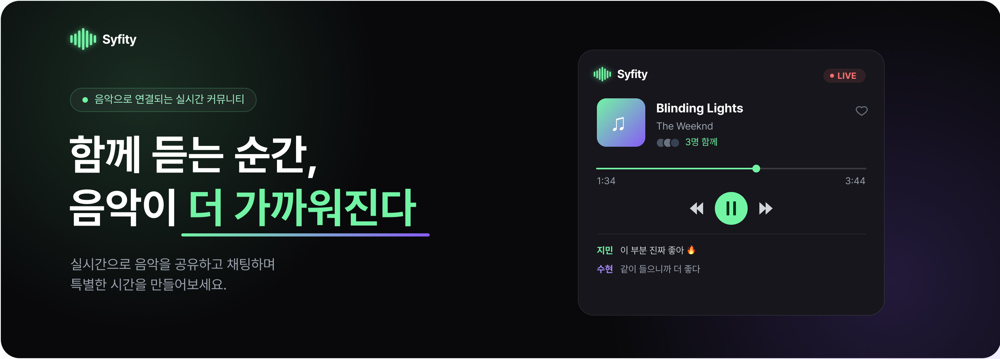
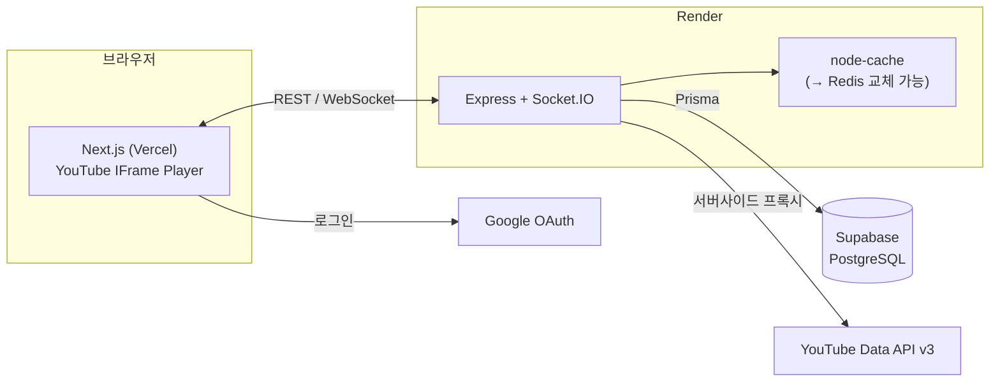

<div align="center">

# 🎵 Syfity



**함께 듣는 실시간 음악 동기화 플랫폼**

🔗 [syfity.site](https://syfity.site)

</div>

Syfity는 여러 사용자가 하나의 Room에 모여 같은 음악을 실시간으로 함께 듣고, 공동 플레이리스트를 관리하며, 채팅으로 소통하는 웹 기반 소셜 리스닝 플랫폼입니다. 서버 절대 시간을 기준으로 재생 위치를 동기화해, 사용자마다 네트워크·버퍼링 환경이 달라도 "같은 곡을 같은 시점에 듣는" 경험을 유지합니다.

<br>

## ✨ 주요 기능

- **Room 관리** — Google 계정 로그인, Room 생성과 초대 코드 기반 입장, 이전에 참여한 Room 최근 목록에서 재입장, 방장·참여자 역할 구분
- **공동 플레이리스트** — YouTube 검색과 YouTube / YouTube Music 공유 링크로 곡 추가, 방장의 재생 순서 관리, 곡 제목·재생 시간·임베드 가능 여부 확인 (영상·음원은 저장하지 않고 `videoId`와 메타데이터만 관리)
- **실시간 재생 동기화** — 방장의 재생·일시정지·탐색·곡 변경을 참여자에게 실시간 전달, 서버 시각 기준 재생 위치 역산, 10초 주기 broadcast와 오차 2초 이상 시 자동 보정 (각 브라우저의 YouTube IFrame Player가 재생, 광고·버퍼링 어긋남 자동 보정) ([상세](./docs/03-realtime-sync-design.md))
- **채팅 & 참여자 상태** — Room 단위 실시간 텍스트 채팅, 입·퇴장 및 Room 종료 시 시스템 메시지 안내, 참여자 온라인 상태와 역할 표시
- **반응형 UI** — 데스크톱·모바일 환경 대응, 재생 정보·플레이리스트·채팅·참여자 목록을 화면 크기에 맞게 배치

<br>

## 🏗️ 시스템 아키텍처



- **Frontend (Vercel)** — Next.js App Router. REST는 TanStack Query, 실시간 상태는 Socket.IO + Zustand로 관리합니다.
- **Backend (Render)** — Express REST API와 Socket.IO를 단일 서버로 운영하고, YouTube Data API를 서버사이드에서 프록시합니다. tsoa로 라우트와 OpenAPI(Swagger) 문서를 자동 생성합니다.
- **Cache** — Host 재생 타이머, 검색 결과, 참여자 상태를 `node-cache`로 관리하되 `ICache` 인터페이스로 추상화해 Redis 교체가 가능합니다.
- **Database** — Supabase PostgreSQL, Prisma로 스키마·마이그레이션·타입을 관리합니다.

<br>

## 🛠️ 기술 스택

| 구분        | 사용 기술                                                  |
| ----------- | ---------------------------------------------------------- |
| Frontend    | Next.js, TypeScript, Tailwind CSS, Zustand, TanStack Query |
| Backend     | Express.js, TypeScript, Socket.IO, Prisma                  |
| Database    | PostgreSQL, Supabase                                       |
| Test · 협업 | Vitest, MSW, GitHub Actions, pnpm Workspace                |
| 배포        | Vercel (FE), Render (BE), Supabase (DB)                    |

<br>

## 📁 프로젝트 구조

pnpm workspace 기반 모노레포입니다. 배포 대상은 `apps/`, 공유 코드는 `packages/`에 둡니다.

```
syfity/
  apps/
    frontend/         → Next.js (Vercel 배포)
    backend/          → Express.js + Socket.IO (Render 배포)
  packages/
    shared/           → 공통 타입·상수·DTO (@syfity/shared)
      src/
        types/        → 공통 도메인 타입
        constants/    → 공통 상수
        dto/          → API 요청/응답 타입
  docs/               → 설계 문서
  supabase/           → DB 마이그레이션
```

FE와 BE는 `@syfity/shared`를 통해 도메인 타입, 상수, API/Socket DTO를 공유합니다.

<br>

## 🚀 시작하기

### 요구 사항

- Node.js, pnpm `11.9.0`

### 설치

```bash
pnpm install
```

### 환경 변수

각 앱의 `.env.example`을 복사해 `.env`를 채웁니다. 프론트엔드는 API·Socket 서버 주소, 백엔드는 JWT 시크릿, `DATABASE_URL`, `YOUTUBE_API_KEY`, Google OAuth 값이 필요합니다.

```bash
cp apps/frontend/.env.example apps/frontend/.env
cp apps/backend/.env.example apps/backend/.env
```

### 실행

```bash
pnpm dev:fe   # 프론트엔드 (shared 빌드 후 Next.js dev)
pnpm dev:be   # 백엔드 (Express + Socket.IO)
```

### 자주 쓰는 스크립트

| 명령                | 설명            |
| ------------------- | --------------- |
| `pnpm format`       | Prettier 포맷팅 |
| `pnpm format:check` | 포맷 검사       |
| `pnpm lint`         | FE / BE ESLint  |

> 커밋 메시지는 commitlint(Conventional Commits) 규칙을 따르며, Husky pre-commit 훅에서 lint-staged가 자동 실행됩니다.

<br>

## 📚 설계 문서

주요 설계 문서는 [`docs/`](./docs)에 정리되어 있습니다.

| 분류     | 문서                                                                                                                                                                                                                                                                        |
| -------- | --------------------------------------------------------------------------------------------------------------------------------------------------------------------------------------------------------------------------------------------------------------------------- |
| 기획     | [00. Project Plan](./docs/00-project-plan.md) · [01. PRD](./docs/01-prd.md) · [98. Market Research](./docs/98-market-research.md) · [99. Technical/Legal Feasibility](./docs/99-technical-legal-feasibility.md)                                                             |
| 아키텍처 | [02. System Architecture](./docs/02-system-architecture.md) · [03. Realtime Sync](./docs/03-realtime-sync-design.md) · [04. Database](./docs/04-database-design.md) · [07. Frontend](./docs/07-frontend-architecture.md) · [08. Backend](./docs/08-backend-architecture.md) |
| 명세     | [05. API Spec](./docs/05-api-spec.md) · [06. Socket Event Spec](./docs/06-socket-event-spec.md) · [09. UI/UX Flow](./docs/09-ui-ux-flow.md) · [10. Design System](./docs/10-design-system.md)                                                                               |
| 운영     | [97. Code Convention](./docs/97-code-convention.md)                                                                                                                                                                                                                         |

<br>

## 👥 팀

김민교 (팀장) · 엄한나 · 이주영 · 이중호
