# 03. Realtime Sync Design

## 1. 문서 정보

| 항목      | 내용                                     |
| --------- | ---------------------------------------- |
| 문서명    | Syfity Realtime Sync Design              |
| 버전      | v1.0                                     |
| 상태      | 초안                                     |
| 작성 목적 | Syfity MVP 실시간 동기화 핵심 설계 정의  |
| 기반 문서 | `01-prd.md`, `02-system-architecture.md` |

---

## 2. 설계 원칙

1. 동기화 기준은 서버 절대 시간이다.
2. 서버가 현재 재생 위치를 역산하여 클라이언트에 전달한다. 클라이언트는 시간 계산 없이 받은 값으로 seek한다.
3. Host의 재생 제어는 서버 PlaybackState를 변경하는 트리거다. 실제 동기화 기준은 서버다.
4. 모든 동기화 보정은 자동이다. 수동 Sync 버튼은 제공하지 않는다.
5. 재생 제어는 Host만 가능하다. 곡 종료 감지도 Host 클라이언트에서만 수행한다.
6. 광고/버퍼링은 제거하거나 우회하지 않는다. 사용자가 재생 가능한 상태가 되면 현재 Room 시점으로 자동 합류한다.

---

## 3. PlaybackState 구조

서버가 관리하는 재생 상태 구조다.

```ts
type PlaybackState = {
  roomId: string;
  videoId?: string;
  playlistItemId?: string;
  baseCurrentTime: number; // 재생 시작/재개 시점의 영상 위치 (초)
  isPlaying: boolean;
  serverStartedAt?: string; // 재생 시작/재개된 서버 시각 (ISO 8601)
  serverPausedAt?: string; // 일시정지된 서버 시각 (ISO 8601)
  updatedAt: string;
};
```

### 현재 재생 위치 계산 (서버)

서버가 broadcast 시점에 현재 재생 위치를 역산하여 클라이언트에 전달한다.

```ts
// 서버에서 계산
const currentTime = baseCurrentTime + (Date.now() - new Date(serverStartedAt).getTime()) / 1000;
```

클라이언트는 이 값을 받아 바로 YouTube Player를 seek한다. 클라이언트-서버 시계 차이 문제가 발생하지 않는다.

---

## 4. 동기화 상수

```ts
const SYNC_CHECK_INTERVAL_MS = 10_000; // 서버 주기 broadcast 간격 (10초)
const SYNC_THRESHOLD_SECONDS = 2; // 자동 보정 허용 오차 (2초)
```

`SYNC_THRESHOLD_SECONDS`는 테스트 결과에 따라 1~3초 범위에서 조정 가능하도록 상수로 관리한다.

---

## 5. 재생 제어 이벤트 처리

### 5.1 play

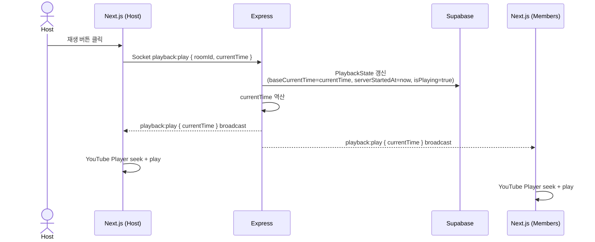

### 5.2 pause

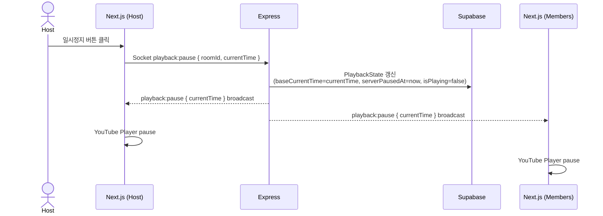

### 5.3 seek

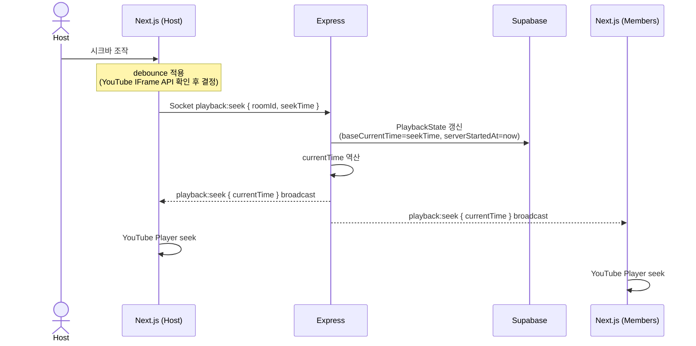

seek debounce 적용 여부는 YouTube IFrame Player API의 seek 이벤트 제공 방식 확인 후 결정한다.

### 5.4 change-track (곡 변경)

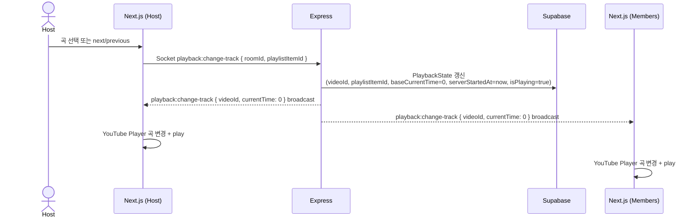

---

## 6. 자동 재생 (곡 종료 처리)

곡 종료 감지는 Host 클라이언트에서만 수행한다. Member 클라이언트에서는 감지하지 않아 중복 이벤트를 방지한다.

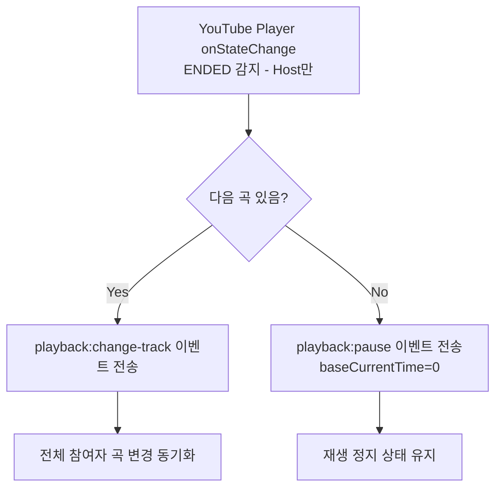

MVP에서는 마지막 곡 종료 시 재생을 정지한다. 반복 재생은 MVP 이후 추가 고려 사항이다.

---

## 7. 신규 사용자 입장 시 동기화

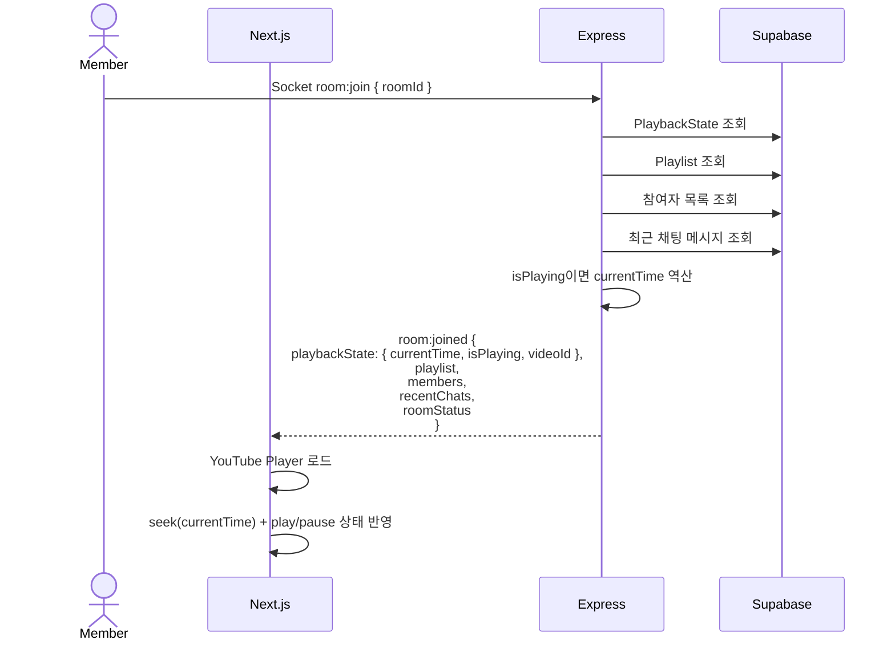

---

## 8. 10초 주기 자동 보정

재생 중인 Room에서만 서버가 10초마다 현재 재생 위치를 broadcast한다. pause 상태에서는 broadcast하지 않는다.

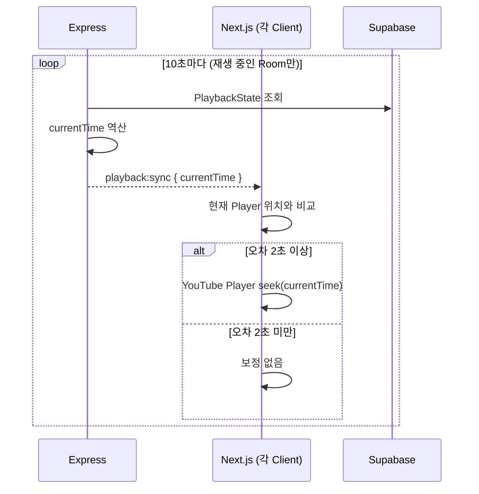

---

## 9. 광고/버퍼링 후 자동 보정

```mermaid
sequenceDiagram
    participant Player as YouTube Player
    participant FE as Next.js (Client)
    participant BE as Express

    Player->>FE: onStateChange → BUFFERING 또는 광고 감지
    FE->>FE: "자동 동기화 대기 중" UI 표시
    Player->>FE: onStateChange → PLAYING (재생 가능 상태)
    FE->>BE: 현재 PlaybackState 요청
    BE->>BE: currentTime 역산
    BE-->>FE: playback:sync { currentTime }
    FE->>FE: 오차 검사
    alt 오차 2초 이상
        FE->>FE: YouTube Player seek(currentTime)
        FE->>FE: "자동 동기화 완료" UI 표시
    else 오차 2초 미만
        FE->>FE: 보정 없음
    end
```

---

## 10. 재연결 시 동기화

네트워크가 일시적으로 끊겼다가 재연결된 경우 신규 입장과 동일하게 처리한다.

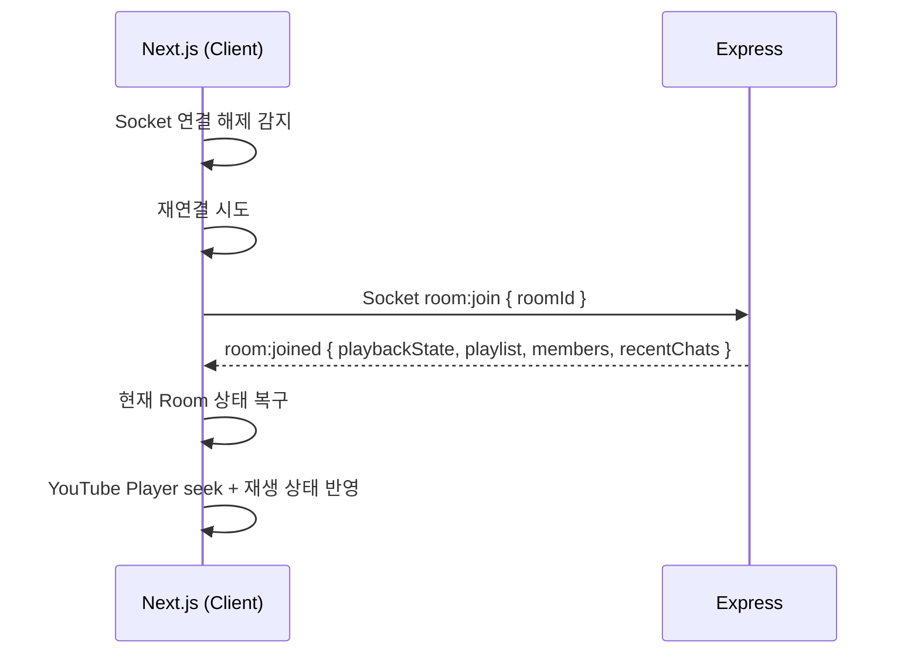

---

## 11. Host 연결 해제 시 재생 처리

Host 연결 해제 시 재생은 계속 진행된다. 서버가 PlaybackState를 보관하고 있으므로 Member들은 10초 주기 broadcast로 동기화를 유지한다.

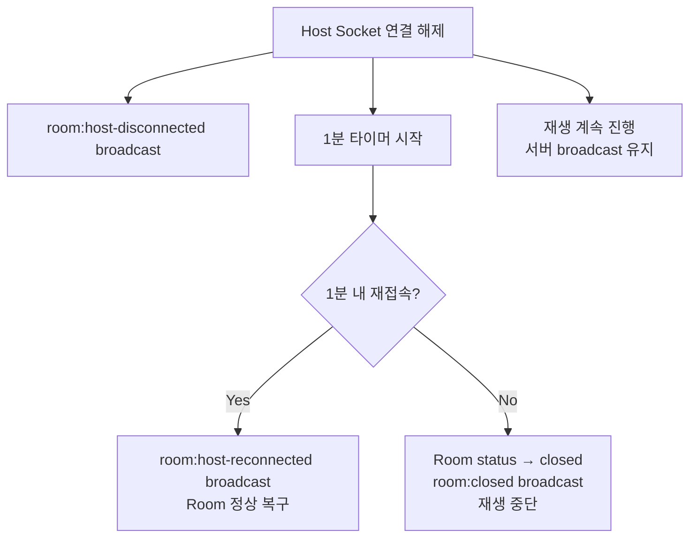

---

## 12. 재생 실패 처리

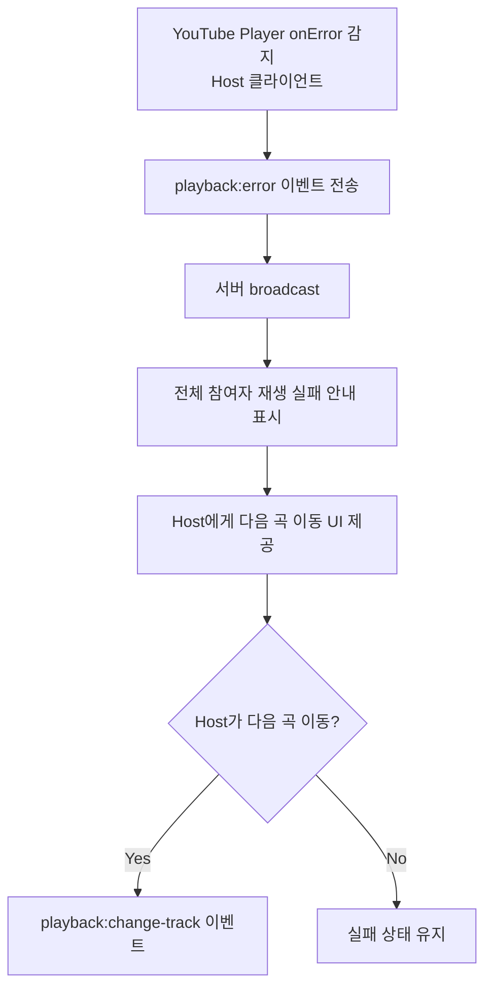

재생 실패한 곡은 Playlist에서 즉시 제거하지 않고 실패 상태(`unavailable`)로 표시한다.

---

## 13. MVP 이후 고려 사항

| 항목                | 내용                                                  |
| ------------------- | ----------------------------------------------------- |
| 반복 재생           | Playlist 전체 반복, 현재 곡 단일 반복                 |
| 부드러운 보정       | 오차가 작을 경우 재생 속도 조절로 자연스럽게 따라잡기 |
| 네트워크 지연 보정  | 사용자별 네트워크 offset 계산                         |
| sync threshold 조정 | Room별 설정 가능하도록 확장                           |
| seek debounce       | YouTube IFrame Player API 확인 후 결정                |
