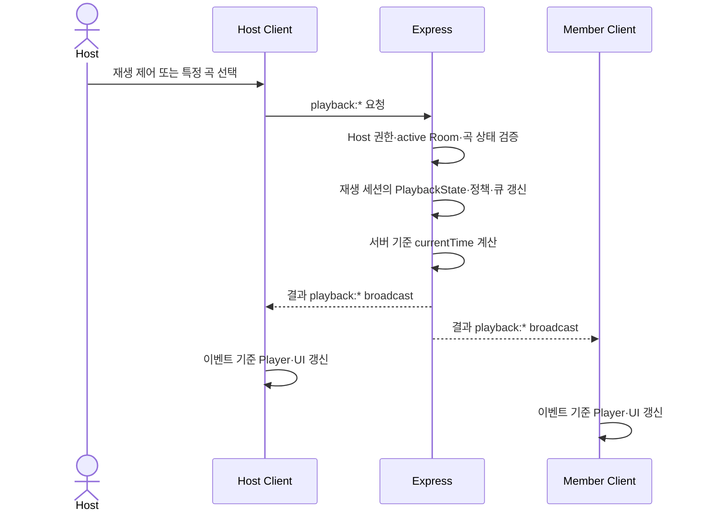
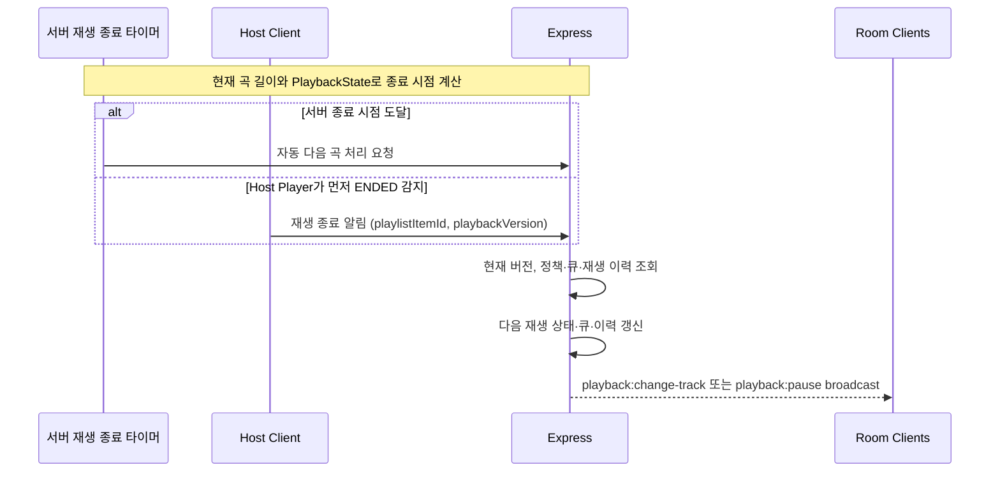
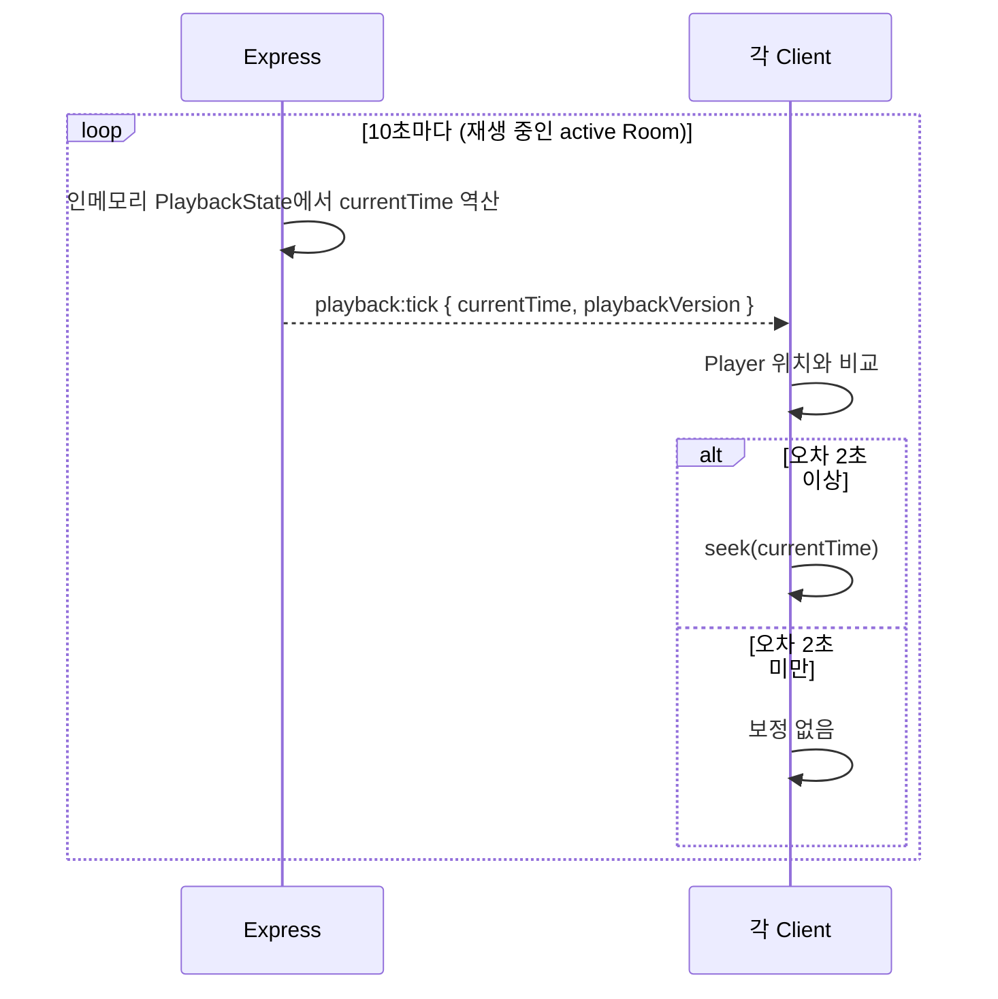
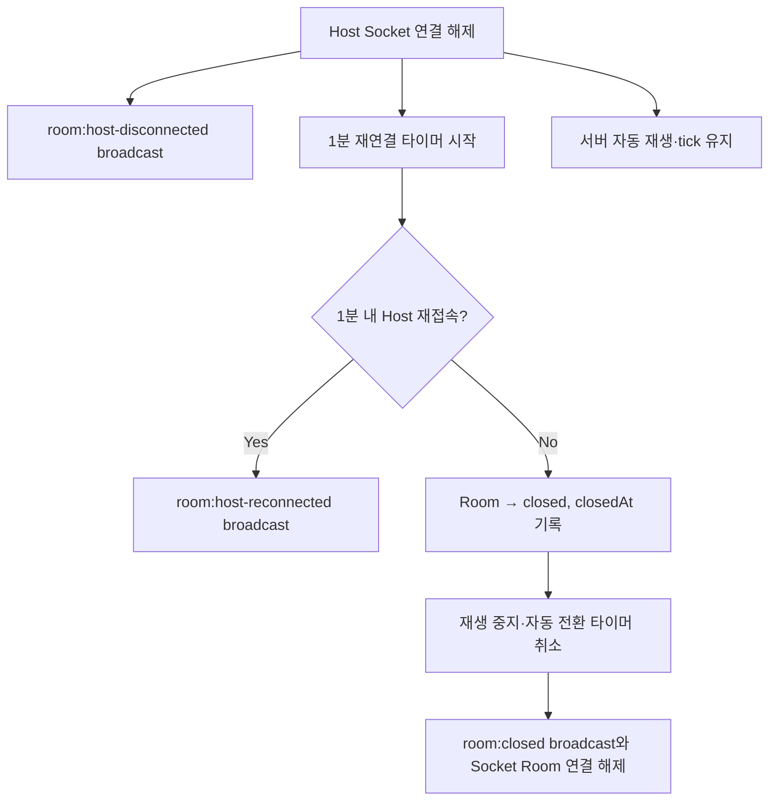
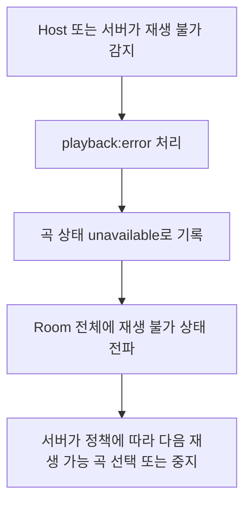

# 03. Realtime Sync Design

## 1. 문서 정보

| 항목      | 내용                                                                                         |
| --------- | -------------------------------------------------------------------------------------------- |
| 문서명    | Syfity Realtime Sync Design                                                                  |
| 버전      | v2.1                                                                                         |
| 상태      | Room 복구 시 채팅 초기화 정책 반영                                                           |
| 작성 목적 | Syfity의 실시간 재생·참여 상태 동기화 설계 정의                                              |
| 기반 문서 | `01-prd.md`, `02-system-architecture.md`, `04-database-design.md`, `06-socket-event-spec.md` |

---

## 2. 설계 원칙

1. 서버의 인메모리 재생 세션이 재생 상태, 반복·셔플 설정, 다음 곡 선택을 결정하는 권위 주체다.
2. Host의 재생 제어와 Player 종료 감지는 서버 상태 변경을 요청하거나 알리는 입력일 뿐이다. Member는 이 입력을 직접 반영하지 않고 서버 Socket 이벤트를 받은 뒤에만 UI와 Player를 변경한다.
3. 서버는 자신의 절대 시간으로 현재 재생 위치를 역산해 전달한다. 클라이언트는 받은 값을 기준으로 Player를 seek한다.
4. 반복·셔플의 내부 큐와 재생 이력은 `playback:{roomId}` 인메모리 재생 세션에만 유지한다. 표시용 Playlist 순서는 바꾸지 않는다.
5. 자동 다음 곡은 서버가 영상 길이와 인메모리 재생 세션을 기준으로 실행한다. Host의 `ENDED` 알림은 전환을 앞당기는 보조 신호이며, Host 연결 해제 중에도 서버 자동 전환은 계속된다.
6. 모든 동기화 보정은 자동이다. 수동 Sync 버튼은 제공하지 않는다.
7. 광고·버퍼링은 제거하거나 우회하지 않는다. Player가 재생 가능해지면 서버 기준 Room 시점으로 자동 합류한다.

---

## 3. 인메모리 재생 세션

### 3.1 재생 상태

```ts
type PlaybackState = {
  roomId: string;
  videoId?: string;
  playlistItemId?: string;
  baseCurrentTime: number;
  isPlaying: boolean;
  serverStartedAt?: string;
  serverPausedAt?: string;
  playbackVersion: number;
  updatedAt: string;
};
```

- `baseCurrentTime`은 재생 시작·재개·seek 시점의 영상 위치(초)다.
- `playbackVersion`은 재생 상태가 바뀔 때 증가한다. 늦게 도착한 종료 알림이나 자동 전환 타이머는 이 값을 확인해 이미 바뀐 곡을 다시 전환하지 않는다.
- 재생 상태는 `playback:{roomId}` 캐시 값으로만 저장한다. 캐시 miss 또는 서버 재시작 시 기본값의 일시정지 상태로 새 세션을 만든다.

### 3.2 재생 정책과 셔플 상태

```ts
type PlaybackPolicy = {
  repeatMode: 'off' | 'all' | 'one';
  shuffleEnabled: boolean;
};

type ShuffleState = {
  roomId: string;
  cycle: number;
  remainingPlaylistItemIds: string[];
  playbackHistoryItemIds: string[];
};
```

- `PlaybackPolicy`는 재생 세션의 상태이며 Member에게 Socket으로 동기화한다.
- `ShuffleState`는 서버 전용 인메모리 상태다. Member UI에는 남은 큐나 재생 이력을 노출하지 않는다.
- 셔플을 켜면 서버는 재생 가능한 곡으로 남은 큐를 만들고, 현재 곡은 이번 사이클에서 이미 재생한 것으로 처리한다.
- 새 곡은 남은 큐의 무작위 위치에 넣고, 삭제·재생 불가 곡은 큐에서도 제거한다. Playlist 순서 변경은 진행 중인 큐를 다시 만들지 않는다.
- 캐시·서버 재시작으로 세션이 유실되면 새 세션은 셔플 해제·반복 없음·일시정지로 시작한다. 이전 셔플 큐와 재생 이력은 복구하지 않는다.

### 3.3 현재 재생 위치 계산

```ts
const currentTime = playbackState.isPlaying
  ? playbackState.baseCurrentTime +
    (Date.now() - new Date(playbackState.serverStartedAt!).getTime()) / 1000
  : playbackState.baseCurrentTime;
```

서버는 현재 곡의 길이를 넘는 값을 전달하지 않도록 보정한다. 클라이언트는 별도의 시계 계산 없이 응답 또는 broadcast의 `currentTime`으로 seek한다.

### 3.4 캐시 miss와 서버 재시작

- `playback:{roomId}`가 없으면 서버는 현재 곡 없음·일시정지·반복 없음·셔플 해제의 기본 재생 세션을 만든다.
- 서버 재시작으로 Socket 연결이 끊긴 클라이언트는 재연결 뒤 기본 재생 세션 snapshot을 받는다. Host가 곡을 선택하거나 재생을 시작하기 전까지 자동 재생하지 않는다.
- 실행 중인 서버에서 재생 세션을 명시적으로 제거하는 경우에는 `playback:reset`을 Room에 전파해 연결된 클라이언트가 Player를 중지하고 초기화한다.
- 클라이언트의 현재 Player 위치로 서버 상태를 복원하지 않는다.

---

## 4. 동기화 상수

```ts
const SYNC_CHECK_INTERVAL_MS = 10_000; // playback:tick 간격
const SYNC_THRESHOLD_SECONDS = 2; // seek 보정 허용 오차
```

`SYNC_THRESHOLD_SECONDS`는 운영 검증 결과에 따라 1~3초 범위에서 조정할 수 있도록 상수로 관리한다.

---

## 5. Host 재생 제어

Host만 `playback:play`, `playback:pause`, `playback:seek`, `playback:change-track` 요청을 보낼 수 있다. 서버는 권한과 Room 상태가 active인지 검증한 뒤 인메모리 재생 세션을 갱신하고 Room 전체에 결과를 broadcast한다.


```mermaid
sequenceDiagram
    actor Host
    participant FE_H as Host Client
    participant BE as Express
    participant FE_M as Member Client

    Host->>FE_H: 재생 제어 또는 특정 곡 선택
    FE_H->>BE: playback:* 요청
    BE->>BE: Host 권한·active Room·곡 상태 검증
    BE->>BE: 재생 세션의 PlaybackState·정책·큐 갱신
    BE->>BE: 서버 기준 currentTime 계산
    BE-->>FE_H: 결과 playback:* broadcast
    BE-->>FE_M: 결과 playback:* broadcast
    FE_H->>FE_H: 이벤트 기준 Player·UI 갱신
    FE_M->>FE_M: 이벤트 기준 Player·UI 갱신
```

- play·pause·seek 요청의 현재 위치는 Host Player가 보고한 입력값을 사용하되, 서버가 저장 시점과 버전을 결정한다.
- 직접 곡 선택은 항상 허용한다. 남은 셔플 큐의 곡이면 큐에서 꺼내 재생하고, 이미 들은 곡이면 즉시 재생하되 남은 큐는 유지한다.
- 이전 곡은 Playlist 표시 순서가 아니라 재생 세션의 이력을 기준으로 선택한다.

---

## 6. 서버 자동 재생

### 6.1 다음 곡 결정 규칙

| 조건                                     | 서버 동작                        |
| ---------------------------------------- | -------------------------------- |
| `repeatMode: one`                        | 현재 곡을 0초부터 다시 재생      |
| 셔플 켜짐, 남은 큐 존재                  | 남은 큐의 다음 곡 재생           |
| 셔플 켜짐, 큐 소진 + `repeatMode: all`   | 새 셔플 큐를 만들고 다음 곡 재생 |
| 셔플 켜짐, 큐 소진 + `repeatMode: off`   | 재생 중지                        |
| 셔플 꺼짐, 다음 Playlist 곡 존재         | 표시 순서의 다음 곡 재생         |
| 셔플 꺼짐, 마지막 곡 + `repeatMode: all` | 첫 곡 재생                       |
| 셔플 꺼짐, 마지막 곡 + `repeatMode: off` | 재생 중지                        |

재생 불가 곡은 자동 선택 대상에서 제외한다. Room 단위 직렬화로 동시 전환을 막고, 선택된 다음 곡·재생 이력·`PlaybackState`를 같은 인메모리 재생 세션에서 함께 갱신한다.

### 6.2 자동 전환 흐름


```mermaid
sequenceDiagram
    participant Timer as 서버 재생 종료 타이머
    participant Host as Host Client
    participant BE as Express
    participant Clients as Room Clients

    Note over Timer,BE: 현재 곡 길이와 PlaybackState로 종료 시점 계산
    alt 서버 종료 시점 도달
        Timer->>BE: 자동 다음 곡 처리 요청
    else Host Player가 먼저 ENDED 감지
        Host->>BE: 재생 종료 알림 (playlistItemId, playbackVersion)
    end
    BE->>BE: 현재 버전, 정책·큐·재생 이력 조회
    BE->>BE: 다음 재생 상태·큐·이력 갱신
    BE-->>Clients: playback:change-track 또는 playback:pause broadcast
```

- 서버 종료 타이머는 인메모리 재생 세션과 함께 관리한다. 서버 재시작 또는 캐시 miss로 세션이 초기화되면 타이머도 복원하지 않는다.
- Host 종료 알림과 타이머가 동시에 도착해도 Room 단위 직렬화와 `playbackVersion` 비교로 한 번만 전환한다.
- Host 연결이 끊겨도 자동 전환은 유지한다. Room이 closed가 되면 타이머를 취소하고 재생을 중지한다.

---

## 7. 입장·재연결과 주기 보정

### 7.1 Room snapshot

Room 입장과 Socket 재연결은 같은 snapshot 계약을 사용한다. `room:joined`의 외부 계약은 `06-socket-event-spec.md`를 기준으로 하며, `packages/shared`의 `RoomJoinedSnapshot` 타입을 FE·BE가 함께 사용한다.

```ts
type PlaybackSnapshot = {
  currentTime: number;
  isPlaying: boolean;
  videoId: string | null;
  playlistItemId: string | null;
  playbackVersion: number;
};

type RoomJoinedSnapshot = {
  roomId: string;
  hostConnection: { status: 'connected' } | { status: 'disconnected'; waitUntil: string };
  playbackState: PlaybackSnapshot;
  playbackPolicy: PlaybackPolicy;
  playlist: PlaylistItem[];
  members: Array<{
    id: string;
    userId: string;
    nickname: string;
    profileImage: string | null;
    role: 'host' | 'member' | 'guest';
    status: 'online' | 'offline' | 'left';
  }>;
  recentChats: ChatMessage[];
};
```

서버 내부 `PlaybackState`의 `baseCurrentTime`, `serverStartedAt` 같은 필드는 snapshot에 노출하지 않는다. `kicked` Member, closed Room, inactive Room은 snapshot을 받지 못한다. Closed Room 복구 뒤 기존 Member는 자동 입장하지 않고, 정상 입장 절차를 다시 거친다.

### 7.2 10초 주기 보정


```mermaid
sequenceDiagram
    participant BE as Express
    participant FE as 각 Client

    loop 10초마다 (재생 중인 active Room)
        BE->>BE: 인메모리 PlaybackState에서 currentTime 역산
        BE-->>FE: playback:tick { currentTime, playbackVersion }
        FE->>FE: Player 위치와 비교
        alt 오차 2초 이상
            FE->>FE: seek(currentTime)
        else 오차 2초 미만
            FE->>FE: 보정 없음
        end
    end
```

pause 상태·closed·inactive Room에서는 `playback:tick`을 보내지 않는다.

### 7.3 버퍼링·광고 후 보정

Player가 재생 가능 상태로 바뀌면 클라이언트는 `playback:sync-request`를 보낸다. 서버는 최신 `currentTime`과 `playbackVersion`을 `playback:sync-response`로 반환한다. 클라이언트는 오차가 임계값 이상일 때만 seek한다.

---

## 8. Room·참여자 상태와 동기화

### 8.1 Host 연결 해제


```mermaid
flowchart TD
    A[Host Socket 연결 해제] --> B[room:host-disconnected broadcast]
    A --> C[1분 재연결 타이머 시작]
    A --> D[서버 자동 재생·tick 유지]
    C --> E{1분 내 Host 재접속?}
    E -->|Yes| F[room:host-reconnected broadcast]
    E -->|No| G[Room → closed, closedAt 기록]
    G --> H[재생 중지·자동 전환 타이머 취소]
    H --> I[room:closed broadcast와 Socket Room 연결 해제]
```

### 8.2 Close·복구·Inactive

- Host가 active Room을 Close하면 재생을 중지하고 모든 Socket Room 연결을 해제한다.
- Host가 closed Room을 복구하면 DB의 Playlist·채팅을 초기화하고 인메모리 재생 세션·자동 전환 타이머를 제거한다. 기존 Member는 자동 입장하지 않는다.
- inactive Room은 Socket 입장·이벤트 처리·재생 동기화를 모두 허용하지 않는다.

### 8.3 추방

- Host가 Member를 추방하면 해당 사용자의 모든 Room Socket 연결을 해제한다.
- `kicked` 상태의 사용자가 `room:join`을 요청하면 서버는 snapshot이나 broadcast 구독을 허용하지 않는다.
- 추방 해제는 `left`로 전환할 뿐 자동 재입장이나 과거 이벤트 재전송을 하지 않는다.

---

## 9. 재생 실패


```mermaid
flowchart TD
    A[Host 또는 서버가 재생 불가 감지] --> B[playback:error 처리]
    B --> C[곡 상태 unavailable로 기록]
    C --> D[Room 전체에 재생 불가 상태 전파]
    D --> E[서버가 정책에 따라 다음 재생 가능 곡 선택 또는 중지]
```

재생 실패한 곡은 Playlist에서 즉시 삭제하지 않는다. 자동 재생과 새 셔플 큐는 `unavailable` 곡을 제외한다.

---

## 10. 향후 검토 항목

| 항목               | 내용                                                          |
| ------------------ | ------------------------------------------------------------- |
| 부드러운 보정      | 작은 오차에서는 seek 대신 재생 속도를 짧게 조절하는 방식 검토 |
| 네트워크 지연 보정 | 사용자별 지연·시계 offset을 이용한 보정 필요성 검토           |
| 동기화 상수 조정   | 운영 환경의 오차·버퍼링 데이터를 바탕으로 tick·threshold 조정 |
