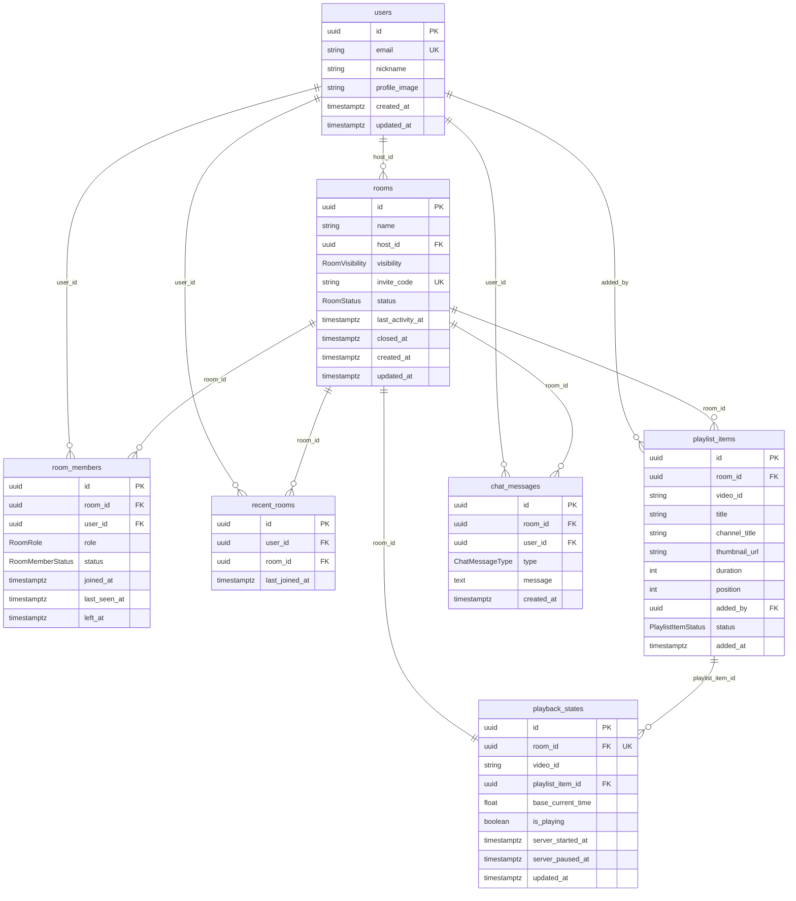

# 04. Database Design

## 1. 문서 정보

| 항목      | 내용                                                                   |
| --------- | ---------------------------------------------------------------------- |
| 문서명    | Syfity Database Design                                                 |
| 버전      | v1.0                                                                   |
| 상태      | 초안                                                                   |
| 작성 목적 | Syfity MVP 데이터베이스 스키마 설계 정의                               |
| 기반 문서 | `01-prd.md`, `02-system-architecture.md`, `03-realtime-sync-design.md` |

---

## 2. 설계 원칙

1. 모든 테이블은 `id`를 UUID로 사용한다.
2. 데이터는 물리 삭제하지 않고 상태값으로 관리한다.
3. 상태값 컬럼은 PostgreSQL enum 타입으로 정의한다. Prisma schema에서도 enum으로 선언하여 TypeScript 타입과 연결한다.
4. Timestamp 컬럼은 `TIMESTAMPTZ`로 저장한다. 애플리케이션에서는 ISO 8601 문자열로 직렬화한다.
5. 스키마 변경은 반드시 Prisma migrate로 관리한다. Supabase 대시보드 직접 수정은 금지한다.

---

## 3. ERD



---

## 4. 테이블 상세

### 4.1 users

Google OAuth로 생성되며, 닉네임과 프로필 이미지는 Google 계정에서 가져온다.

| 컬럼          | 타입        | 제약         | 설명                        |
| ------------- | ----------- | ------------ | --------------------------- |
| id            | UUID        | PK           | 사용자 고유 식별자          |
| email         | VARCHAR     | UK, NOT NULL | Google 계정 이메일          |
| nickname      | VARCHAR     | NOT NULL     | 표시 이름 (Google 계정명)   |
| profile_image | VARCHAR     | NULLABLE     | 프로필 이미지 URL           |
| refresh_token | VARCHAR     | NULLABLE     | Refresh Token (로그아웃 시) |
| created_at    | TIMESTAMPTZ | NOT NULL     | 계정 생성 시각              |
| updated_at    | TIMESTAMPTZ | NOT NULL     | 마지막 정보 수정 시각       |

---

### 4.2 rooms

Room 정보를 저장한다. 삭제하지 않고 `status`로 상태를 관리한다.

| 컬럼             | 타입                 | 제약         | 설명                                          |
| ---------------- | -------------------- | ------------ | --------------------------------------------- |
| id               | UUID                 | PK           | Room 고유 식별자                              |
| name             | VARCHAR              | NOT NULL     | Room 이름                                     |
| host_id          | UUID                 | FK, NOT NULL | 현재 Host 사용자 ID                           |
| visibility       | ENUM(RoomVisibility) | NOT NULL     | `private` \| `public`                         |
| invite_code      | VARCHAR(8)           | UK, NOT NULL | 초대 코드. Hex 6자리, 8자리로 확장 가능       |
| status           | ENUM(RoomStatus)     | NOT NULL     | `active` \| `inactive` \| `closed`            |
| last_activity_at | TIMESTAMPTZ          | NOT NULL     | 마지막 활동 시각 (30일 초과 시 inactive 처리) |
| closed_at        | TIMESTAMPTZ          | NULLABLE     | Room 종료 시각                                |
| created_at       | TIMESTAMPTZ          | NOT NULL     | Room 생성 시각                                |
| updated_at       | TIMESTAMPTZ          | NOT NULL     | 마지막 수정 시각                              |

**status 정의**

| 값       | 설명                                          |
| -------- | --------------------------------------------- |
| active   | 입장 및 재생 가능한 Room                      |
| inactive | 마지막 활동 후 30일 이상 지나 비활성화된 Room |
| closed   | Host가 종료했거나 Host 미복귀로 닫힌 Room     |

**last_activity_at 갱신 기준**

다음 이벤트 발생 시 `last_activity_at`을 갱신한다.

- 참여자 입장/퇴장
- 채팅 메시지 전송
- 플레이리스트 곡 추가/삭제/순서 변경
- 재생 제어 이벤트 (play, pause, seek, change-track)

---

### 4.3 room_members

Room 참여자 정보를 저장한다. 퇴장하거나 재입장해도 레코드를 새로 삽입하지 않고 기존 레코드를 업데이트한다.

| 컬럼         | 타입                   | 제약         | 설명                            |
| ------------ | ---------------------- | ------------ | ------------------------------- |
| id           | UUID                   | PK           | 참여자 레코드 고유 식별자       |
| room_id      | UUID                   | FK, NOT NULL | 소속 Room ID                    |
| user_id      | UUID                   | FK, NOT NULL | 사용자 ID                       |
| role         | ENUM(RoomRole)         | NOT NULL     | `host` \| `member` \| `guest`   |
| status       | ENUM(RoomMemberStatus) | NOT NULL     | `online` \| `offline` \| `left` |
| joined_at    | TIMESTAMPTZ            | NOT NULL     | 최초 입장 시각                  |
| last_seen_at | TIMESTAMPTZ            | NULLABLE     | 마지막 접속 확인 시각           |
| left_at      | TIMESTAMPTZ            | NULLABLE     | 퇴장 시각                       |

**인덱스**

- `(room_id, user_id)` UNIQUE → 동일 Room에 같은 사용자 중복 레코드 방지. 재입장 시 기존 레코드 업데이트

**재입장 처리 정책**

- 재입장 시 `status`, `last_seen_at`만 업데이트한다.
- `joined_at`은 최초 입장 시각으로 유지한다.

---

### 4.4 recent_rooms

사용자가 최근 참여한 Room 목록을 저장한다. 재입장할 때마다 `last_joined_at`을 갱신한다.

| 컬럼           | 타입        | 제약         | 설명               |
| -------------- | ----------- | ------------ | ------------------ |
| id             | UUID        | PK           | 레코드 고유 식별자 |
| user_id        | UUID        | FK, NOT NULL | 사용자 ID          |
| room_id        | UUID        | FK, NOT NULL | Room ID            |
| last_joined_at | TIMESTAMPTZ | NOT NULL     | 마지막 입장 시각   |

**인덱스**

- `(user_id, room_id)` UNIQUE → 사용자별 Room 중복 방지
- `(user_id, last_joined_at DESC)` → 최근 Room 목록 정렬 쿼리 최적화

**upsert 정책**

- Room 입장 시 `(user_id, room_id)` 기준으로 upsert 처리한다.
- 최초 입장이면 INSERT, 재입장이면 `last_joined_at`만 UPDATE한다.

```sql
INSERT INTO recent_rooms (user_id, room_id, last_joined_at)
VALUES (:userId, :roomId, NOW())
ON CONFLICT (user_id, room_id)
DO UPDATE SET last_joined_at = NOW();
```

**조회 정책**

- `active` 상태인 Room만 표시한다.
- `inactive`, `closed` Room은 표시하지 않는다.
- `last_joined_at` 내림차순 정렬로 반환한다.

---

### 4.5 playlist_items

Room의 공동 플레이리스트 항목을 저장한다.

| 컬럼          | 타입                     | 제약         | 설명                                                                  |
| ------------- | ------------------------ | ------------ | --------------------------------------------------------------------- |
| id            | UUID                     | PK           | 항목 고유 식별자                                                      |
| room_id       | UUID                     | FK, NOT NULL | 소속 Room ID                                                          |
| video_id      | VARCHAR                  | NOT NULL     | YouTube videoId                                                       |
| title         | VARCHAR                  | NOT NULL     | 영상 제목                                                             |
| channel_title | VARCHAR                  | NOT NULL     | 채널명                                                                |
| thumbnail_url | VARCHAR                  | NOT NULL     | 썸네일 URL                                                            |
| duration      | INTEGER                  | NOT NULL     | 재생 시간 (초 단위. YouTube API 응답 PT3M30S → 210으로 변환하여 저장) |
| position      | INTEGER                  | NOT NULL     | 재생 순서 (1부터 시작)                                                |
| added_by      | UUID                     | FK, NOT NULL | 추가한 사용자 ID                                                      |
| status        | ENUM(PlaylistItemStatus) | NOT NULL     | `available` \| `unavailable`                                          |
| added_at      | TIMESTAMPTZ              | NOT NULL     | 추가 시각                                                             |

**인덱스**

- `(room_id, position)` → 플레이리스트 순서 조회 최적화

**순서 변경 정책**

- `position`은 1부터 시작하는 정수로 관리한다.
- Host가 순서 변경 시 영향받는 항목의 `position`을 트랜잭션으로 일괄 업데이트한다.

---

### 4.6 playback_states

Room의 현재 재생 상태를 저장한다. Room당 1개 레코드를 유지하며, Room 생성 시 함께 생성한다.

| 컬럼              | 타입        | 제약             | 설명                                 |
| ----------------- | ----------- | ---------------- | ------------------------------------ |
| id                | UUID        | PK               | 레코드 고유 식별자                   |
| room_id           | UUID        | FK, UK, NOT NULL | Room ID (Room당 1개)                 |
| video_id          | VARCHAR     | NULLABLE         | 현재 재생 중인 YouTube videoId       |
| playlist_item_id  | UUID        | FK, NULLABLE     | 현재 재생 중인 playlist_items ID     |
| base_current_time | FLOAT       | NOT NULL         | 재생 시작/재개 시점의 영상 위치 (초) |
| is_playing        | BOOLEAN     | NOT NULL         | 재생 중 여부                         |
| server_started_at | TIMESTAMPTZ | NULLABLE         | 재생 시작/재개된 서버 시각           |
| server_paused_at  | TIMESTAMPTZ | NULLABLE         | 일시정지된 서버 시각                 |
| updated_at        | TIMESTAMPTZ | NOT NULL         | 마지막 갱신 시각                     |

**Room 생성 시 초기값**

```ts
{
  video_id: null,
  playlist_item_id: null,
  base_current_time: 0,
  is_playing: false,
  server_started_at: null,
  server_paused_at: null,
}
```

**currentTime 역산 (서버)**

```ts
// 재생 중일 때
const currentTime = base_current_time + (Date.now() - new Date(server_started_at).getTime()) / 1000;

// 일시정지 중일 때
const currentTime = base_current_time;
```

---

### 4.7 chat_messages

Room의 채팅 메시지를 저장한다. 시스템 메시지도 동일 테이블에서 관리한다.

| 컬럼       | 타입                  | 제약         | 설명                                    |
| ---------- | --------------------- | ------------ | --------------------------------------- |
| id         | UUID                  | PK           | 메시지 고유 식별자                      |
| room_id    | UUID                  | FK, NOT NULL | 소속 Room ID                            |
| user_id    | UUID                  | FK, NULLABLE | 작성자 사용자 ID (시스템 메시지는 NULL) |
| type       | ENUM(ChatMessageType) | NOT NULL     | `user` \| `system`                      |
| message    | TEXT                  | NOT NULL     | 메시지 내용                             |
| created_at | TIMESTAMPTZ           | NOT NULL     | 작성 시각                               |

**인덱스**

- `(room_id, created_at DESC, id DESC)` → 복합 커서 기반 페이지네이션 최적화

**채팅 로드 정책**

- 최초 입장 시 최근 50개를 로드한다.
- 위로 스크롤 시 `(created_at, id)` 복합 커서 기준으로 이전 50개를 추가 로드한다.
- `created_at`이 같은 메시지가 여러 개일 경우 `id`로 추가 정렬하여 중복/누락을 방지한다.
- 최신 메시지가 아래에 표시되며, 위로 스크롤할수록 과거 메시지가 로드된다.

---

## 5. 타입 정의 요약

DB에서 enum 타입으로 정의하며, Prisma schema에서도 동일하게 enum으로 선언한다.

```prisma
enum RoomVisibility {
  private
  public
}

enum RoomStatus {
  active
  inactive
  closed
}

enum RoomRole {
  host
  member
  guest
}

enum RoomMemberStatus {
  online
  offline
  left
}

enum PlaylistItemStatus {
  available
  unavailable
}

enum ChatMessageType {
  user
  system
}
```

---

## 6. 주요 쿼리 패턴

### 최근 Room 목록 조회

```sql
SELECT rr.*, r.name, r.status, r.invite_code
FROM recent_rooms rr
JOIN rooms r ON rr.room_id = r.id
WHERE rr.user_id = :userId
  AND r.status = 'active'
ORDER BY rr.last_joined_at DESC;
```

### Room 입장 시 초기 데이터 조회

```sql
-- PlaybackState
SELECT * FROM playback_states
WHERE room_id = :roomId;

-- Playlist (순서대로)
SELECT * FROM playlist_items
WHERE room_id = :roomId
ORDER BY position ASC;

-- 온라인 참여자 목록
SELECT rm.*, u.nickname, u.profile_image
FROM room_members rm
JOIN users u ON rm.user_id = u.id
WHERE rm.room_id = :roomId
  AND rm.status = 'online';

-- 최근 채팅 메시지 (최근 50개, FE에서 역순 표시)
SELECT cm.*, u.nickname, u.profile_image
FROM chat_messages cm
LEFT JOIN users u ON cm.user_id = u.id
WHERE cm.room_id = :roomId
ORDER BY cm.created_at DESC
LIMIT 50;
```

### 채팅 이전 메시지 로드 (복합 커서 기반)

```sql
SELECT cm.*, u.nickname, u.profile_image
FROM chat_messages cm
LEFT JOIN users u ON cm.user_id = u.id
WHERE cm.room_id = :roomId
  AND (cm.created_at, cm.id) < (:cursorTime, :cursorId)
ORDER BY cm.created_at DESC, cm.id DESC
LIMIT 50;
```

### inactive 처리 배치 (하루 1회)

```sql
UPDATE rooms
SET status = 'inactive', updated_at = NOW()
WHERE status = 'active'
  AND last_activity_at < NOW() - INTERVAL '30 days';
```
