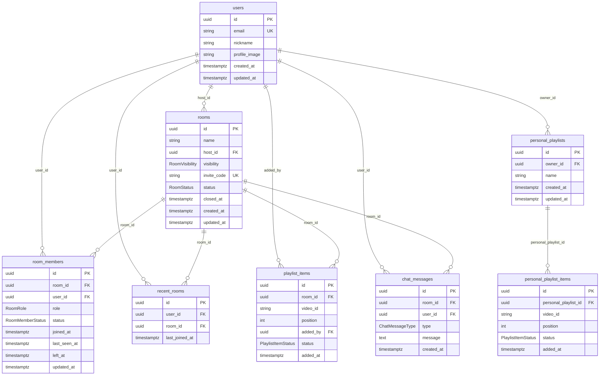

# 04. Database Design

## 1. 문서 정보

| 항목      | 내용                                                                   |
| --------- | ---------------------------------------------------------------------- |
| 문서명    | Syfity Database Design                                                 |
| 버전      | v2.3                                                                   |
| 상태      | 계정 탈퇴 시각을 추가해 기존 토큰을 인증 단계에서 차단                 |
| 작성 목적 | Syfity 전체 기능의 PostgreSQL·Prisma 스키마 설계 정의                  |
| 기반 문서 | `01-prd.md`, `02-system-architecture.md`, `03-realtime-sync-design.md` |

---

## 2. 설계 원칙

1. 모든 기본 키는 UUID를 사용한다.
2. Room, 참여 이력, 채팅은 물리 삭제하지 않고 상태로 보존한다. 사용자가 명시적으로 삭제한 Room Playlist·개인 Playlist와 그 곡은 예외로 hard delete한다.
3. 상태값은 PostgreSQL enum과 Prisma enum으로 함께 선언한다.
4. 시각은 `TIMESTAMPTZ`로 저장하고 API에서는 ISO 8601 문자열로 직렬화한다.
5. 현재 곡, 재생 위치, 반복·셔플, 셔플 큐, 재생 이력은 인메모리 재생 세션으로 관리한다. DB는 Room의 영속 데이터만 저장한다.
6. 스키마 변경은 Prisma migration으로만 적용한다. Supabase 대시보드에서 직접 수정하지 않는다.

---

## 3. ERD


```mermaid
erDiagram
    users {
        uuid id PK
        string email UK
        string nickname
        string profile_image
        timestamptz created_at
        timestamptz updated_at
    }

    rooms {
        uuid id PK
        string name
        uuid host_id FK
        RoomVisibility visibility
        string invite_code UK
        RoomStatus status
        timestamptz closed_at
        timestamptz created_at
        timestamptz updated_at
    }

    room_members {
        uuid id PK
        uuid room_id FK
        uuid user_id FK
        RoomRole role
        RoomMemberStatus status
        timestamptz joined_at
        timestamptz last_seen_at
        timestamptz left_at
        timestamptz updated_at
    }

    recent_rooms {
        uuid id PK
        uuid user_id FK
        uuid room_id FK
        timestamptz last_joined_at
    }

    playlist_items {
        uuid id PK
        uuid room_id FK
        string video_id
        int position
        uuid added_by FK
        PlaylistItemStatus status
        timestamptz added_at
    }

    chat_messages {
        uuid id PK
        uuid room_id FK
        uuid user_id FK
        ChatMessageType type
        text message
        timestamptz created_at
    }

    personal_playlists {
        uuid id PK
        uuid owner_id FK
        string name
        timestamptz created_at
        timestamptz updated_at
    }

    personal_playlist_items {
        uuid id PK
        uuid personal_playlist_id FK
        string video_id
        int position
        PlaylistItemStatus status
        timestamptz added_at
    }

    users ||--o{ rooms : host_id
    users ||--o{ room_members : user_id
    users ||--o{ recent_rooms : user_id
    users ||--o{ playlist_items : added_by
    users ||--o{ chat_messages : user_id
    users ||--o{ personal_playlists : owner_id
    rooms ||--o{ room_members : room_id
    rooms ||--o{ recent_rooms : room_id
    rooms ||--o{ playlist_items : room_id
    rooms ||--o{ chat_messages : room_id
    personal_playlists ||--o{ personal_playlist_items : personal_playlist_id
```

---

## 4. 테이블 상세

### 4.1 users

Google OAuth로 생성되는 사용자 계정이다.

| 컬럼                   | 타입        | 제약         | 설명                                                   |
| ---------------------- | ----------- | ------------ | ------------------------------------------------------ |
| id                     | UUID        | PK           | 사용자 식별자                                          |
| email                  | VARCHAR     | UK, NOT NULL | Google 계정 이메일                                     |
| nickname               | VARCHAR     | NOT NULL     | 표시 이름                                              |
| profile_image          | VARCHAR     | NULLABLE     | 프로필 이미지 URL                                      |
| refresh_token          | VARCHAR     | NULLABLE     | Google Refresh Token                                   |
| onboarded_at           | TIMESTAMPTZ | NULLABLE     | 최초 온보딩 완료 시각                                  |
| deletion_pending_at    | TIMESTAMPTZ | NULLABLE     | 탈퇴 정리 시작 시각. 존재하는 동안 신규 인증·쓰기 차단 |
| deleted_at             | TIMESTAMPTZ | NULLABLE     | 계정 탈퇴 완료 시각. 존재하면 기존 토큰 인증을 거부    |
| created_at, updated_at | TIMESTAMPTZ | NOT NULL     | 생성·수정 시각                                         |

### 4.2 rooms

Room은 삭제하지 않고 상태로 관리한다.

| 컬럼                   | 타입                 | 제약         | 설명                                            |
| ---------------------- | -------------------- | ------------ | ----------------------------------------------- |
| id                     | UUID                 | PK           | Room 식별자                                     |
| name                   | VARCHAR              | NOT NULL     | Room 이름                                       |
| host_id                | UUID                 | FK, NOT NULL | 생성자이자 Host                                 |
| visibility             | ENUM(RoomVisibility) | NOT NULL     | 현재는 `private`만 생성. `public`은 확장 예약값 |
| invite_code            | VARCHAR(8)           | UK, NOT NULL | 초대 코드                                       |
| status                 | ENUM(RoomStatus)     | NOT NULL     | `active` \| `closed` \| `inactive`              |
| closed_at              | TIMESTAMPTZ          | NULLABLE     | closed 전환 시각. active 복구 시 NULL           |
| created_at, updated_at | TIMESTAMPTZ          | NOT NULL     | 생성·수정 시각                                  |

**상태 전환과 보존 정책**

```text
active → closed → active
                 → inactive
```

- active에서 Host 명시적 Close 또는 Host 재접속 타임아웃으로 closed가 되면 `closed_at`을 기록한다.
- closed 상태에서 Host 복구 시 `closed_at`을 NULL로 되돌린다.
- Host 명시적 전환 또는 `closed_at` 후 30일 경과 시 inactive가 된다. inactive는 복구하지 않는다.
- `last_activity_at`은 inactive 판단에 사용하지 않으므로 두지 않는다.

**인덱스**

- `(host_id, status, updated_at DESC)` — Home의 `내 Room` 목록
- `(closed_at) WHERE status = 'closed'` — 일일 만료 처리와 Home 조회 보정

### 4.3 room_members

한 사용자는 Room당 하나의 참여 이력만 가진다. 재입장은 기존 행을 갱신한다.

| 컬럼             | 타입                   | 제약         | 설명                                                  |
| ---------------- | ---------------------- | ------------ | ----------------------------------------------------- |
| id               | UUID                   | PK           | 참여 이력 식별자                                      |
| room_id, user_id | UUID                   | FK, NOT NULL | Room·사용자                                           |
| role             | ENUM(RoomRole)         | NOT NULL     | `host` \| `member` \| `guest` (`guest`는 확장 예약값) |
| status           | ENUM(RoomMemberStatus) | NOT NULL     | `online` \| `offline` \| `left` \| `kicked`           |
| joined_at        | TIMESTAMPTZ            | NOT NULL     | 최초 입장 시각                                        |
| last_seen_at     | TIMESTAMPTZ            | NULLABLE     | 마지막 Socket 접속 확인 시각                          |
| left_at          | TIMESTAMPTZ            | NULLABLE     | 일반 퇴장 시각                                        |
| updated_at       | TIMESTAMPTZ            | NOT NULL     | 상태 변경 시각                                        |

- `(room_id, user_id)` UNIQUE로 중복 참여 이력을 막는다.
- `(room_id, status)` 인덱스로 참여자 목록과 Host 전용 추방 목록을 조회한다.
- `kicked` 사용자는 초대 코드·링크·최근 Room·`room:join`으로 재입장할 수 없다. 추방 해제 시 `left`로 바꾼다.

### 4.4 recent_rooms

최근 Room 재입장 목록이다. `(user_id, room_id)`를 UNIQUE로 두고 입장 때 `last_joined_at`을 upsert한다.

- `(user_id, last_joined_at DESC)` 인덱스로 정렬한다.
- active Room이면서 현재 `room_members.status`가 `kicked`가 아닌 경우만 표시한다.
- closed·inactive Room은 이 목록에 보이지 않는다. Host의 `내 Room` 목록은 `rooms.host_id`로 active·closed 상태만 별도 조회한다.

### 4.5 playlist_items

Room 공동 Playlist 항목이다. 영상 메타데이터(`video_id`, `title`, `channel_title`, `thumbnail_url`, `duration`), `position`, `added_by`, `status`, `added_at`, `metadata_refreshed_at`을 저장한다. YouTube Data API 메타데이터는 25일 경과 시 갱신 대상으로 조회한다.

- `(room_id, position)` 인덱스로 표시 순서를 조회한다.
- 같은 Room의 동일 `video_id` 중복은 허용하지 않는다. `(room_id, video_id)` UNIQUE로 보장한다.
- 곡 삭제는 hard delete다. 현재 곡이면 서버가 인메모리 재생 세션에서 다음 상태를 먼저 결정한 뒤 삭제한다.
- 인메모리 재생 세션의 셔플 큐·이력에서도 해당 항목을 제거한다.

### 4.6 chat_messages

Room 채팅과 시스템 메시지다. `user_id`는 시스템 메시지에서 NULL이고, `type`은 `user` 또는 `system`이다. 표준 Unicode 이모지도 `message` TEXT에 그대로 저장한다.

- `(room_id, created_at DESC, id DESC)` 인덱스로 복합 커서 페이지네이션을 수행한다.
- 최초 입장 시 최근 50개, 과거 조회 시 `(created_at, id)` 복합 커서를 사용한다.

### 4.7 personal_playlists

사용자 소유의 개인 Playlist다.

| 컬럼                   | 타입        | 제약         | 설명                 |
| ---------------------- | ----------- | ------------ | -------------------- |
| id                     | UUID        | PK           | 개인 Playlist 식별자 |
| owner_id               | UUID        | FK, NOT NULL | 작성자               |
| name                   | VARCHAR     | NOT NULL     | Playlist 이름        |
| created_at, updated_at | TIMESTAMPTZ | NOT NULL     | 생성·수정 시각       |

- `(owner_id, updated_at DESC)` 인덱스로 내 Playlist 목록을 조회한다.
- 작성자만 조회·수정·삭제할 수 있다.
- 삭제는 hard delete이며, `personal_playlist_items` 외래 키의 `ON DELETE CASCADE`로 항목도 같은 트랜잭션에서 삭제한다. 보존 기간이나 cleanup cron은 필요하지 않다.

### 4.8 personal_playlist_items

개인 Playlist 항목은 Room Playlist와 같은 영상 메타데이터 및 `metadata_refreshed_at`을 보관하고, 25일 경과 시 갱신 대상으로 조회한다.

개인 Playlist의 곡이다. Room Playlist와 같은 영상 메타데이터와 `position`, `status`, `added_at`을 저장한다.

- `(personal_playlist_id, video_id)` UNIQUE로 개인 Playlist 안의 중복 곡을 막는다.
- `(personal_playlist_id, position)` non-unique 인덱스로 표시 순서를 조회한다. 여러 항목의 position을 맞바꾸는 트랜잭션에서 중간 UNIQUE 충돌을 피하기 위해, 순서 정합성(전체 항목 id 집합 일치와 `1..n` 연속 position)은 Service 계층에서 보장한다.
- 개별 곡 삭제는 hard delete다. Room으로 불러오기는 이 테이블을 읽어 Room Playlist 끝에 일회성 복사한다.

---

## 5. enum 정의

```prisma
enum RoomVisibility {
  private
  public
}

enum RoomStatus {
  active
  closed
  inactive
}

enum RoomRole {
  host
  member
  guest
}

enum RoomMemberStatus {
  online
  offline
  left
  kicked
}

enum PlaylistItemStatus {
  available
  unavailable
}

enum ChatMessageType {
  user
  system
}
```

`public`과 `guest`는 향후 공개 Room·비로그인 참여 확장을 위한 예약값이다. 현재 생성·입장 정책에서는 `private`, `host`, `member`만 허용한다.

---

## 6. 주요 쿼리 패턴

### 6.1 최근 Room 목록

```sql
SELECT rr.*, r.name, r.status, r.invite_code
FROM recent_rooms rr
JOIN rooms r ON r.id = rr.room_id
JOIN room_members rm ON rm.room_id = r.id AND rm.user_id = rr.user_id
WHERE rr.user_id = :userId
  AND r.status = 'active'
  AND rm.status <> 'kicked'
ORDER BY rr.last_joined_at DESC;
```

### 6.2 Host의 내 Room 목록

```sql
SELECT id, name, status, closed_at, updated_at
FROM rooms
WHERE host_id = :hostId
  AND status IN ('active', 'closed')
ORDER BY updated_at DESC;
```

### 6.3 Closed Room inactive 전환

GitHub Actions의 일일 내부 API와 Host의 Home 조회·복구 시 보정 로직이 같은 서비스 메서드를 호출한다.

```sql
UPDATE rooms
SET status = 'inactive', updated_at = NOW()
WHERE status = 'closed'
  AND closed_at <= NOW() - INTERVAL '30 days';
```

### 6.4 Room 복구 초기화

하나의 DB 트랜잭션에서 다음을 수행한다.

1. Room이 Host 소유의 `closed` 상태인지와 30일 만료 여부를 확인한다.
2. Room Playlist를 삭제한다.
3. Room을 `active`로, `closed_at`을 NULL로 갱신한다.

DB 트랜잭션이 성공한 뒤 해당 Room의 인메모리 재생 세션을 제거한다. 다음 입장 또는 Host 재생 제어 시 기본값의 새 세션을 만든다.

채팅, Member 참여 이력, `kicked` 상태, 최근 Room 이력은 삭제하지 않는다.
